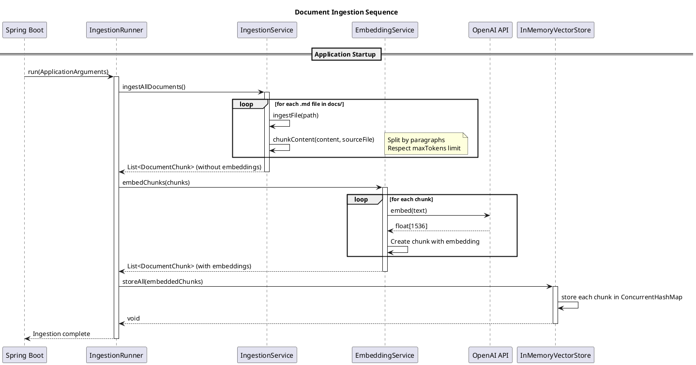
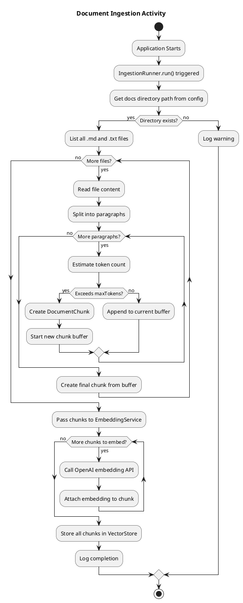
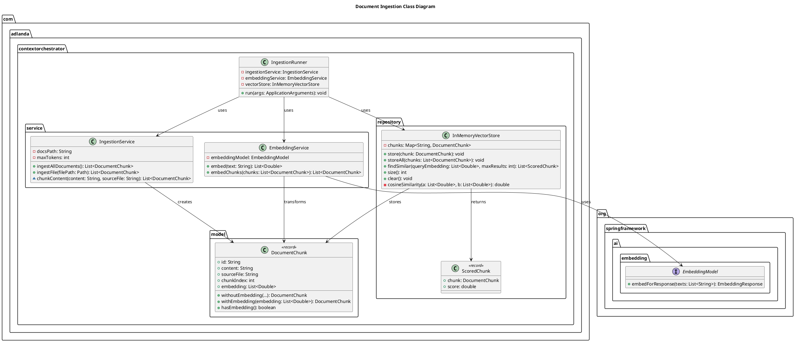

# Document Ingestion Process

This document explains how documents are read, processed, and indexed during application startup. It's designed to help developers understand the codebase and effectively debug the ingestion pipeline.

---

## Overview

When the AI Context Orchestrator starts, it automatically reads all markdown files from a configured directory, converts them into vector embeddings, and stores them in memory for semantic search. This process is called **document ingestion**.


---

## Sequence Diagram



---

## Classes Involved

The ingestion process involves 5 main classes:

| Class | Package | Responsibility |
|-------|---------|----------------|
| `IngestionRunner` | `com.adlanda.contextorchestrator` | Orchestrates the entire ingestion process on startup |
| `IngestionService` | `com.adlanda.contextorchestrator.service` | Reads files and splits them into chunks |
| `EmbeddingService` | `com.adlanda.contextorchestrator.service` | Converts text into vector embeddings via OpenAI |
| `InMemoryVectorStore` | `com.adlanda.contextorchestrator.repository` | Stores chunks and supports similarity search |
| `DocumentChunk` | `com.adlanda.contextorchestrator.model` | Data model representing a piece of a document |

---

## Detailed Class Descriptions

### 1. IngestionRunner

**File:** `src/main/java/com/adlanda/contextorchestrator/IngestionRunner.java`

This class implements Spring's `ApplicationRunner` interface, which means its `run()` method is called automatically after the Spring context is initialized.

```java
@Component
@Order(1) // Run before StartupInfoLogger
public class IngestionRunner implements ApplicationRunner {

    @Override
    public void run(ApplicationArguments args) {
        // 1. Read and chunk documents
        List<DocumentChunk> chunks = ingestionService.ingestAllDocuments();

        // 2. Generate embeddings
        List<DocumentChunk> embeddedChunks = embeddingService.embedChunks(chunks);

        // 3. Store in vector store
        vectorStore.storeAll(embeddedChunks);
    }
}
```

**Key Points:**
- `@Order(1)` ensures this runs before other `ApplicationRunner` implementations
- Orchestrates the 3-step process: read → embed → store
- Handles errors gracefully and logs progress

---

### 2. IngestionService

**File:** `src/main/java/com/adlanda/contextorchestrator/service/IngestionService.java`

Responsible for reading files from the filesystem and splitting them into manageable chunks.

```java
@Service
public class IngestionService {

    @Value("${orchestrator.docs.path:./docs}")
    private String docsPath;

    @Value("${orchestrator.chunking.max-tokens:512}")
    private int maxTokens;

    public List<DocumentChunk> ingestAllDocuments() {
        // Walks the docs directory
        // Filters for .md and .txt files
        // Returns list of DocumentChunk objects
    }
}
```

**Key Methods:**

| Method | Description |
|--------|-------------|
| `ingestAllDocuments()` | Scans the docs directory and returns all chunks |
| `ingestFile(Path)` | Reads a single file and creates chunks |
| `chunkContent(String, String)` | Splits text into chunks respecting token limits |

**Chunking Strategy (Iteration 1):**
- Splits content by double newlines (paragraphs)
- Estimates tokens as `characters / 4`
- Creates new chunk when `maxTokens` (default: 512) is exceeded

---

### 3. EmbeddingService

**File:** `src/main/java/com/adlanda/contextorchestrator/service/EmbeddingService.java`

Converts text into vector embeddings using OpenAI's API via Spring AI.

```java
@Service
public class EmbeddingService {

    private final EmbeddingModel embeddingModel; // Injected by Spring AI

    public List<Double> embed(String text) {
        EmbeddingResponse response = embeddingModel.embedForResponse(List.of(text));
        float[] embedding = response.getResult().getOutput();
        return toDoubleList(embedding);
    }
}
```

**Key Points:**
- Uses Spring AI's `EmbeddingModel` abstraction
- Configured to use `text-embedding-3-small` (1536 dimensions)
- Converts `float[]` from API to `List<Double>` for storage

---

### 4. InMemoryVectorStore

**File:** `src/main/java/com/adlanda/contextorchestrator/repository/InMemoryVectorStore.java`

Stores document chunks and their embeddings in memory, supporting similarity search.

```java
@Repository
public class InMemoryVectorStore {

    private final Map<String, DocumentChunk> chunks = new ConcurrentHashMap<>();

    public void storeAll(List<DocumentChunk> chunksToStore) {
        chunksToStore.forEach(this::store);
    }

    public List<ScoredChunk> findSimilar(List<Double> queryEmbedding, int maxResults) {
        // Computes cosine similarity between query and all stored chunks
        // Returns top N results sorted by score
    }
}
```

**Key Points:**
- Uses `ConcurrentHashMap` for thread safety
- Implements cosine similarity for vector comparison
- Returns `ScoredChunk` records containing chunk + similarity score

---

### 5. DocumentChunk

**File:** `src/main/java/com/adlanda/contextorchestrator/model/DocumentChunk.java`

Immutable data record representing a piece of a document.

```java
public record DocumentChunk(
    String id,           // Unique UUID
    String content,      // The actual text
    String sourceFile,   // e.g., "spring-ai-guide.md"
    int chunkIndex,      // Position within source file
    List<Double> embedding  // 1536-dimensional vector (null before embedding)
) {
    public static DocumentChunk withoutEmbedding(...) { }
    public DocumentChunk withEmbedding(List<Double> embedding) { }
    public boolean hasEmbedding() { }
}
```

**Lifecycle:**
1. Created by `IngestionService` **without** embedding (`withoutEmbedding()`)
2. Transformed by `EmbeddingService` to include embedding (`withEmbedding()`)
3. Stored in `InMemoryVectorStore` with embedding

---

## Configuration

Configuration is in `src/main/resources/application.properties`:

```properties
# Directory containing documents to ingest
orchestrator.docs.path=${DOCS_PATH:./docs}

# Maximum tokens per chunk (affects chunking granularity)
orchestrator.chunking.max-tokens=512

# OpenAI embedding model
spring.ai.openai.embedding.options.model=text-embedding-3-small

# API key (from environment variable)
spring.ai.openai.api-key=${OPENAI_API_KEY:your-api-key-here}
```

---

## Debugging Guide

### Recommended Breakpoints

Here are the key locations to set breakpoints when debugging the ingestion process:

| # | Class | Method | Line | What to Inspect |
|---|-------|--------|------|-----------------|
| 1 | `IngestionRunner` | `run()` | 46 | Entry point - verify startup |
| 2 | `IngestionService` | `ingestAllDocuments()` | 47 | Check if docs directory is found |
| 3 | `IngestionService` | `ingestFile()` | 71 | Verify file content is read correctly |
| 4 | `IngestionService` | `chunkContent()` | 104 | Inspect chunking logic |
| 5 | `EmbeddingService` | `embed()` | 35 | Verify API call and response |
| 6 | `EmbeddingService` | `embedChunks()` | 50 | Check chunk-to-embedding mapping |
| 7 | `InMemoryVectorStore` | `store()` | 28 | Verify chunks have embeddings |

### Step-by-Step Debugging

**To debug the full ingestion process:**

1. **Set breakpoint in `IngestionRunner.run()` at line 46**
   - This is where `ingestionService.ingestAllDocuments()` is called
   - Inspect: Are the dependencies injected correctly?

2. **Step into `ingestAllDocuments()`**
   - Check the `docsPath` value (should be `./docs` or your custom path)
   - Verify `Files.exists(docsDir)` returns `true`

3. **Set breakpoint at line 52 in the forEach loop**
   - Inspect: Which files are being processed?
   - Check `path.getFileName()` for each iteration

4. **Step into `chunkContent()`**
   - Inspect: How is the content being split?
   - Check `paragraphs` array after split
   - Monitor `currentChunk` and `estimatedTokens`

5. **Set breakpoint in `EmbeddingService.embed()` at line 35**
   - Inspect: What text is being sent to OpenAI?
   - Check `response.getResult().getOutput()` dimensions (should be 1536)

6. **Set breakpoint in `InMemoryVectorStore.store()` at line 28**
   - Inspect: Does the chunk have an embedding?
   - Check `chunk.embedding().size()` equals 1536

### Common Issues

| Issue | Symptom | Cause | Solution |
|-------|---------|-------|----------|
| No documents found | "No documents found to ingest" log | Wrong `docsPath` | Check `orchestrator.docs.path` config |
| API authentication error | 401 Unauthorized | Invalid/missing API key | Set `OPENAI_API_KEY` environment variable |
| Empty embeddings | `chunk.hasEmbedding()` returns false | API call failed | Check network, API key, model name |
| Wrong chunk count | Unexpected number of chunks | Chunking config | Adjust `orchestrator.chunking.max-tokens` |

---

## Activity Diagram



---

## Class Diagram



---

## Quick Reference: File Locations

```
ai-context-orchestrator/
├── src/main/java/com/adlanda/contextorchestrator/
│   ├── OrchestratorApplication.java      # Main entry point
│   ├── IngestionRunner.java              # Startup orchestration (LINE 41: run())
│   ├── model/
│   │   └── DocumentChunk.java            # Data model
│   ├── service/
│   │   ├── IngestionService.java         # File reading & chunking (LINE 37: ingestAllDocuments())
│   │   └── EmbeddingService.java         # OpenAI API calls (LINE 34: embed())
│   └── repository/
│       └── InMemoryVectorStore.java      # Vector storage (LINE 37: storeAll())
└── src/main/resources/
    └── application.properties            # Configuration
```

---

## Summary

The document ingestion process follows a clear 3-step pipeline:

1. **Read & Chunk** (`IngestionService`): Files are read from disk and split into smaller pieces
2. **Embed** (`EmbeddingService`): Each chunk is converted to a 1536-dimensional vector via OpenAI
3. **Store** (`InMemoryVectorStore`): Chunks with embeddings are stored for similarity search

To debug effectively:
- Start at `IngestionRunner.run()` and step through
- Check configuration values in `IngestionService`
- Verify API responses in `EmbeddingService`
- Confirm storage in `InMemoryVectorStore`