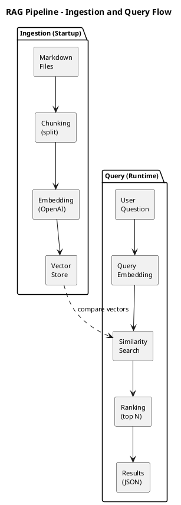

# Iteration 1: Minimal RAG Implementation

This document explains what the AI Context Orchestrator does after Iteration 1 and how it's built.

## What the Application Does

The AI Context Orchestrator is a **semantic search engine for your documentation**. Instead of searching for exact keywords, it understands the *meaning* of your question and finds the most relevant content.

Here's the basic flow:

1. **You have markdown files** in a `docs/` folder
2. **On startup**, the application reads those files and converts them into searchable vectors
3. **When you ask a question**, the app finds the most semantically similar content

For example, if your docs mention "concurrent request handling" and you ask "how do I handle multiple users at once?", the system understands these are related concepts and returns that content, even though the words don't match exactly.

## How It Works: The RAG Pipeline

RAG stands for **Retrieval Augmented Generation**. It's a technique for giving AI systems access to specific knowledge. Here's our pipeline:



### Step 1: Ingestion (Reading Documents)

The `IngestionService` scans the `docs/` folder for markdown and text files. For each file, it:

1. Reads the entire file content
2. Splits it into smaller pieces called "chunks"

**Why chunk?** Embedding models have token limits, and smaller chunks give more precise search results. A 50-page document as one chunk would be too coarse for useful retrieval.

**Current chunking strategy:** We split by paragraphs (double newlines) and combine paragraphs until we approach ~512 tokens. This is naive but functional. Future iterations will use smarter, markdown-aware chunking.

### Step 2: Embedding (Converting Text to Vectors)

The `EmbeddingService` converts each text chunk into a **vector**. A vector is just a list of numbers (1536 numbers, to be exact, when using OpenAI's `text-embedding-3-small` model).

These numbers encode the *meaning* of the text. Similar meanings produce similar vectors. This is the magic that enables semantic search.

| Text | Vector (first 3 of 1536 dimensions) | Notes |
|------|-------------------------------------|-------|
| "How do I handle concurrent requests?" | [0.023, -0.041, 0.067, ...] | Query |
| "Managing multiple simultaneous users" | [0.021, -0.039, 0.065, ...] | Similar meaning, similar vector |
| "The weather is nice today" | [-0.015, 0.082, -0.034, ...] | Different meaning, different vector |

### Step 3: Storage (The Vector Store)

The `InMemoryVectorStore` holds all chunks with their embeddings. It's a simple `ConcurrentHashMap` in memory.

**Why in-memory?** For Iteration 1, simplicity beats persistence. This lets us focus on the core RAG logic without database setup. The data is re-indexed on every startup, which is fine for small document sets.

### Step 4: Query Processing

When you send a question to `POST /api/v1/query`:

1. **Embed the question**: Your question gets converted to a vector using the same embedding model
2. **Find similar chunks**: We compare your question's vector against every stored chunk using **cosine similarity**
3. **Return top results**: The most similar chunks are returned, sorted by relevance score

**Cosine similarity** measures how similar two vectors are by looking at the angle between them. A score of 1.0 means identical direction (very similar meaning), 0.0 means orthogonal (unrelated).

## The Components

### Models (Data Structures)

| Class | Purpose |
|-------|---------|
| `DocumentChunk` | Represents a piece of text with its source file, position, and embedding |
| `QueryRequest` | The JSON body you send: `{"question": "...", "maxResults": 5}` |
| `QueryResponse` | What you get back: results, total chunks, query time |
| `QueryResult` | A single result: content, source file, chunk index, similarity score |

### Services (Business Logic)

| Class | Purpose |
|-------|---------|
| `IngestionService` | Reads files and splits them into chunks |
| `EmbeddingService` | Converts text to vectors via OpenAI |
| `RetrievalService` | Orchestrates the query flow: embed → search → return |

### Controllers (API Endpoints)

| Endpoint | Method | Purpose |
|----------|--------|---------|
| `/api/v1` | GET | API discovery (lists available endpoints) |
| `/api/v1/query` | POST | Semantic search |
| `/api/v1/sources` | GET | Index statistics |

### Repository

| Class | Purpose |
|-------|---------|
| `InMemoryVectorStore` | Stores chunks, performs similarity search |

### Startup Components

| Class | Purpose |
|-------|---------|
| `IngestionRunner` | Runs ingestion automatically on startup |
| `StartupInfoLogger` | Prints API info after startup completes |

## Using the API

### Query for Context

```bash
curl -X POST http://localhost:8080/api/v1/query \
  -H "Content-Type: application/json" \
  -d '{"question": "How do virtual threads work?", "maxResults": 3}'
```

Response:
```json
{
  "results": [
    {
      "content": "Virtual threads are lightweight threads...",
      "sourceFile": "virtual-threads.md",
      "chunkIndex": 0,
      "score": 0.89
    }
  ],
  "totalChunks": 42,
  "queryTimeMs": 15
}
```

### Check Index Status

```bash
curl http://localhost:8080/api/v1/sources
```

Response:
```json
{
  "totalChunks": 42,
  "status": "indexed"
}
```

## Configuration

Key settings in `application.properties`:

| Property | What it does | Default |
|----------|--------------|---------|
| `orchestrator.docs.path` | Where to look for documents | `./docs` |
| `orchestrator.chunking.max-tokens` | Max tokens per chunk | `512` |
| `spring.ai.openai.api-key` | Your OpenAI API key | (required) |
| `spring.ai.openai.embedding.options.model` | Which embedding model | `text-embedding-3-small` |

## Limitations of Iteration 1

This is a minimal implementation with intentional limitations:

1. **In-memory storage**: All data is lost on restart. Every startup re-indexes everything.
2. **Naive chunking**: Paragraphs might split mid-thought. Headers and code blocks aren't treated specially.
3. **No batching**: Each chunk gets its own API call. Slow and expensive for large document sets.
4. **Markdown only**: Only `.md` and `.txt` files are processed.
5. **No incremental updates**: Can't add or remove documents without restarting.

## What's Coming Next

### Iteration 2: Persistent Storage with PGVector
Replace the in-memory store with PostgreSQL + PGVector extension. Documents persist across restarts, and we can use database-level vector indexing for faster searches.

### Iteration 3: Smart Chunking
Markdown-aware chunking that respects document structure. Headers stay with their content, code blocks aren't split, and chunks overlap slightly for better context.

### Iteration 4: Multiple Source Types
Support for Java files, JSON, YAML, and other formats. Source-specific parsers extract meaningful chunks.

### Iteration 5: API Refinement
Filters (by source type, date), pagination, and a refresh endpoint to re-index without restart.

### Iteration 6: Context Optimization
Token budgeting, source prioritization, and caching for frequently-asked questions.

### Iteration 7: Production Hardening
Rate limiting, authentication, metrics, and production-ready configuration.

## Summary

Iteration 1 delivers a working semantic search system:

- Drop markdown files in `docs/`
- Start the application
- Query via REST API
- Get relevant context for your AI assistant

It's simple, but it works. The foundation is solid for the enhancements coming in future iterations.
