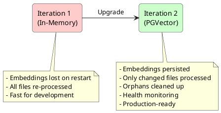
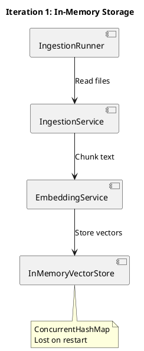
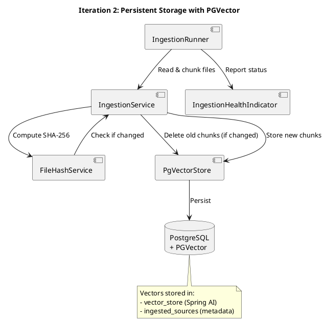
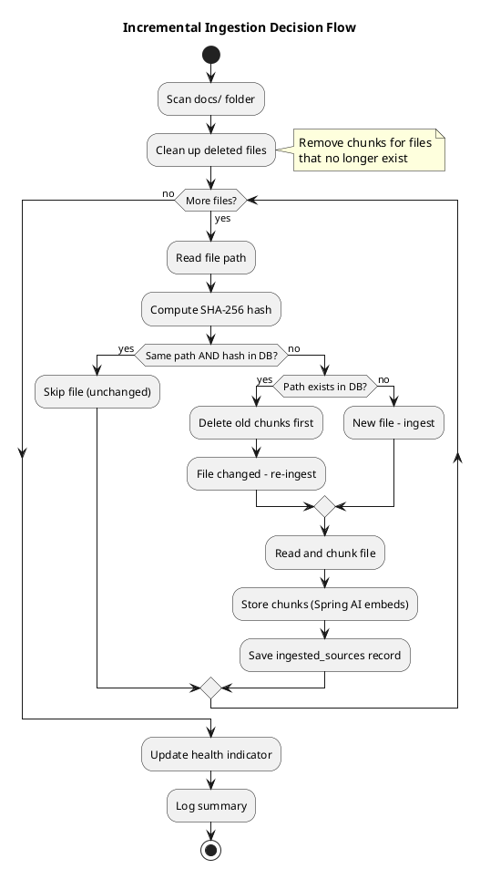

# Iteration 2: Persistent Storage with PGVector

This document explains the implementation of Iteration 2, which replaces the in-memory vector store with PostgreSQL + PGVector for persistent storage, and adds incremental ingestion to avoid re-processing unchanged files.

---

## Overview

**Goal:** Replace in-memory store with PGVector for persistence, and implement incremental ingestion.

**Key Features:**
1. **Persistent Vector Storage**: Embeddings survive application restarts
2. **Incremental Ingestion**: Only new or changed files are processed
3. **File Hash Tracking**: SHA-256 hashes detect file changes
4. **Orphan Cleanup**: Old chunks deleted when files change or are removed
5. **File Deletion Detection**: Chunks removed when source files are deleted
6. **Health Monitoring**: Custom health indicator for ingestion status
7. **PostgreSQL Integration**: Uses PGVector extension for vector similarity search



---

## Prerequisites

### 1. Docker Desktop

Install Docker Desktop for Windows/Mac/Linux to run PostgreSQL with PGVector.

- **Windows/Mac**: Download from [docker.com](https://www.docker.com/products/docker-desktop/)
- **Linux**: Install via package manager

### 2. OpenAI API Key

Set your API key as an environment variable:

```powershell
# PowerShell
$env:OPENAI_API_KEY = "sk-your-api-key-here"
```

```bash
# Bash/Linux/Mac
export OPENAI_API_KEY=sk-your-api-key-here
```

---

## How to Run

### Step 1: Start PostgreSQL with PGVector

From the project root directory (`ai-context-orchestrator/`):

```bash
docker-compose up -d
```

This starts a PostgreSQL 16 container with:
- **Database**: `orchestrator`
- **User**: `orchestrator`
- **Password**: `orchestrator`
- **Port**: `5432`
- **PGVector extension**: Pre-installed

Verify it's running:

```bash
docker-compose ps
```

Expected output:
```
NAME                    STATUS    PORTS
orchestrator-postgres   healthy   0.0.0.0:5432->5432/tcp
```

### Step 2: Run the Application

```bash
mvn spring-boot:run
```

On first startup:
1. Spring AI creates the vector table automatically
2. The init.sql script creates the `ingested_sources` tracking table
3. All documents in `docs/` are ingested and embedded
4. Embeddings are stored in PostgreSQL

### Step 3: Verify Incremental Ingestion

Restart the application:

```bash
# Stop with Ctrl+C, then:
mvn spring-boot:run
```

On second startup, you should see:
```
INFO  - Starting document ingestion...
INFO  - No changes detected. Index is up to date (X files tracked)
```

This confirms that unchanged files are skipped!

### Step 4: Test Change Detection

1. Edit any file in `docs/` (e.g., add a space)
2. Restart the application
3. You should see only that file being re-ingested
4. Old chunks are automatically deleted before new ones are stored

### Step 5: Test File Deletion Detection

1. Delete a file from `docs/`
2. Restart the application
3. You should see the file's chunks being removed from the index

---

## Architecture Changes

### Before (Iteration 1)



### After (Iteration 2)



---

## New Components

### 1. FileHashService

**File:** `src/main/java/com/adlanda/contextorchestrator/service/FileHashService.java`

Computes SHA-256 hashes of file contents for change detection.

```java
@Service
public class FileHashService {

    public String computeHash(Path filePath) throws IOException {
        MessageDigest digest = MessageDigest.getInstance("SHA-256");
        byte[] fileBytes = Files.readAllBytes(filePath);
        byte[] hashBytes = digest.digest(fileBytes);
        return HexFormat.of().formatHex(hashBytes);
    }
}
```

**Why SHA-256?**
- Cryptographically secure (no collisions)
- Fast to compute
- 64-character hex string fits in database column

### 2. IngestedSource Entity

**File:** `src/main/java/com/adlanda/contextorchestrator/entity/IngestedSource.java`

JPA entity tracking which files have been ingested.

```java
@Entity
@Table(name = "ingested_sources")
public class IngestedSource {
    @Id
    private UUID id;

    @Column(unique = true)
    private String filePath;

    private String fileHash;      // SHA-256 hash
    private Long fileSize;
    private Integer chunkCount;
    private LocalDateTime ingestedAt;
    private LocalDateTime updatedAt;
}
```

### 3. IngestedSourceRepository

**File:** `src/main/java/com/adlanda/contextorchestrator/repository/IngestedSourceRepository.java`

Spring Data JPA repository for change detection queries.

```java
@Repository
public interface IngestedSourceRepository extends JpaRepository<IngestedSource, UUID> {

    // Check if exact file (path + hash) exists
    boolean existsByFilePathAndFileHash(String filePath, String fileHash);

    // Find by path (to check if hash changed)
    Optional<IngestedSource> findByFilePath(String filePath);

    // Total chunk count for statistics
    @Query("SELECT COALESCE(SUM(s.chunkCount), 0) FROM IngestedSource s")
    long sumChunkCount();
}
```

### 4. PgVectorStore

**File:** `src/main/java/com/adlanda/contextorchestrator/repository/PgVectorStore.java`

Wrapper around Spring AI's VectorStore with native SQL support for orphan cleanup.

```java
@Repository
public class PgVectorStore {

    private final VectorStore vectorStore;
    private final JdbcTemplate jdbcTemplate;

    public void storeAll(List<DocumentChunk> chunks) {
        List<Document> documents = chunks.stream()
                .map(this::toDocument)
                .toList();
        vectorStore.add(documents);
    }

    public int deleteBySourceFile(String sourceFile) {
        // Native SQL for metadata-based deletion
        String sql = "DELETE FROM vector_store WHERE metadata->>'sourceFile' = ?";
        return jdbcTemplate.update(sql, sourceFile);
    }

    public List<ScoredChunk> findSimilarByText(String queryText, int maxResults) {
        SearchRequest request = SearchRequest.query(queryText)
                .withTopK(maxResults);
        return vectorStore.similaritySearch(request);
    }
}
```

### 5. IngestionHealthIndicator

**File:** `src/main/java/com/adlanda/contextorchestrator/health/IngestionHealthIndicator.java`

Custom health indicator for monitoring ingestion status.

```java
@Component
public class IngestionHealthIndicator implements HealthIndicator {

    public void markHealthy(IngestionSummary summary) { ... }
    public void markUnhealthy(String error) { ... }

    @Override
    public Health health() {
        // Returns UP with file counts, or DOWN with error details
    }
}
```

### 6. IngestionProperties

**File:** `src/main/java/com/adlanda/contextorchestrator/config/IngestionProperties.java`

Configuration properties for ingestion behavior.

```java
@Component
@ConfigurationProperties(prefix = "orchestrator.ingestion")
public class IngestionProperties {
    private boolean incremental = true;  // Enable/disable incremental ingestion
}
```

---

## Database Schema

### Table: ingested_sources

Tracks metadata about ingested files.

```sql
CREATE TABLE ingested_sources (
    id UUID PRIMARY KEY DEFAULT gen_random_uuid(),
    file_path VARCHAR(500) UNIQUE NOT NULL,
    file_hash VARCHAR(64) NOT NULL,      -- SHA-256 hash
    file_size BIGINT,
    chunk_count INTEGER DEFAULT 0,
    ingested_at TIMESTAMP DEFAULT NOW(),
    updated_at TIMESTAMP DEFAULT NOW()
);
```

### Table: vector_store (Spring AI managed)

Stores document chunks with vector embeddings.

```sql
-- Created automatically by Spring AI PGVector
CREATE TABLE vector_store (
    id UUID PRIMARY KEY,
    content TEXT,
    metadata JSONB,
    embedding vector(1536)
);

-- HNSW index for fast similarity search
CREATE INDEX ON vector_store
USING hnsw (embedding vector_cosine_ops);
```

---

## Incremental Ingestion Flow



---

## Configuration

### application.properties

```properties
# PostgreSQL connection
spring.datasource.url=jdbc:postgresql://${DB_HOST:localhost}:${DB_PORT:5432}/${DB_NAME:orchestrator}
spring.datasource.username=${DB_USER:orchestrator}
spring.datasource.password=${DB_PASSWORD:orchestrator}

# Schema Management
# JPA validates ingested_sources table (created by init.sql)
spring.jpa.hibernate.ddl-auto=validate

# Spring AI auto-creates vector_store table
spring.ai.vectorstore.pgvector.initialize-schema=true

# Spring AI PGVector settings
spring.ai.vectorstore.pgvector.index-type=HNSW
spring.ai.vectorstore.pgvector.distance-type=COSINE_DISTANCE
spring.ai.vectorstore.pgvector.dimensions=1536

# Enable incremental ingestion with orphan cleanup
orchestrator.ingestion.incremental=true
```

### Environment Variables

| Variable | Default | Description |
|----------|---------|-------------|
| `DB_HOST` | `localhost` | PostgreSQL host |
| `DB_PORT` | `5432` | PostgreSQL port |
| `DB_NAME` | `orchestrator` | Database name |
| `DB_USER` | `orchestrator` | Database user |
| `DB_PASSWORD` | `orchestrator` | Database password |
| `OPENAI_API_KEY` | - | OpenAI API key (required) |

---

## Health Monitoring

The application exposes ingestion health via Spring Actuator:

```bash
curl http://localhost:8080/actuator/health
```

**Healthy Response:**
```json
{
  "status": "UP",
  "components": {
    "ingestion": {
      "status": "UP",
      "details": {
        "lastRun": "2026-01-01T10:30:00Z",
        "filesTracked": 15,
        "filesProcessed": 2,
        "filesSkipped": 13,
        "filesDeleted": 0,
        "chunksIndexed": 12
      }
    }
  }
}
```

**Unhealthy Response:**
```json
{
  "status": "DOWN",
  "components": {
    "ingestion": {
      "status": "DOWN",
      "details": {
        "error": "Database error during ingestion: Connection refused",
        "lastAttempt": "2026-01-01T10:30:00Z"
      }
    }
  }
}
```

---

## Debugging Guide

### Breakpoints for Incremental Ingestion

| # | Class | Method | What to Inspect |
|---|-------|--------|-----------------|
| 1 | `IngestionService` | `processFile()` | File path and computed hash |
| 2 | `IngestionService` | `cleanupDeletedFiles()` | Files being removed |
| 3 | `PgVectorStore` | `deleteBySourceFile()` | Orphan chunk deletion |
| 4 | `FileHashService` | `computeHash()` | The computed hash value |

### Common Issues

| Issue | Symptom | Cause | Solution |
|-------|---------|-------|----------|
| Connection refused | App fails to start | PostgreSQL not running | Run `docker-compose up -d` |
| All files re-ingested | No skipping on restart | Wrong database URL | Check `spring.datasource.url` |
| Empty results | Query returns nothing | Table not initialized | Set `spring.ai.vectorstore.pgvector.initialize-schema=true` |
| Hash mismatch | File keeps re-ingesting | File modified each time | Check for auto-formatters or line ending changes |
| Orphaned chunks | Old data in results | Upgrade from old version | Run cleanup SQL below |

### Cleanup Script for Orphaned Data

If upgrading from a version without orphan cleanup:

```sql
-- Remove chunks for files no longer in ingested_sources
DELETE FROM vector_store v
WHERE NOT EXISTS (
    SELECT 1 FROM ingested_sources s 
    WHERE s.file_path = v.metadata->>'sourceFile'
);
```

---

## Docker Commands Reference

```bash
# Start PostgreSQL
docker-compose up -d

# Stop PostgreSQL (keeps data)
docker-compose stop

# Stop and remove containers (keeps data in volume)
docker-compose down

# Stop and remove everything including data
docker-compose down -v

# View logs
docker-compose logs -f postgres

# Connect to database with psql
docker exec -it orchestrator-postgres psql -U orchestrator -d orchestrator

# View ingested sources
docker exec -it orchestrator-postgres psql -U orchestrator -d orchestrator -c "SELECT file_path, file_hash, chunk_count FROM ingested_sources;"
```

---

## Testing Persistence

### Test 1: Restart Persistence

1. Start app and ingest documents
2. Stop app
3. Restart app
4. Verify: "No changes detected. Index is up to date"
5. Query documents - should return results from DB

### Test 2: Change Detection

1. Start app (documents already ingested)
2. Edit a file in `docs/`
3. Restart app
4. Verify: Only the changed file is re-ingested
5. Verify: Old chunks deleted before new ones stored

### Test 3: New File Detection

1. Start app (documents already ingested)
2. Add a new `.md` file to `docs/`
3. Restart app
4. Verify: Only the new file is ingested

### Test 4: File Deletion Detection

1. Start app (documents already ingested)
2. Delete a file from `docs/`
3. Restart app
4. Verify: File's chunks removed from index
5. Query - should not return results from deleted file

### Test 5: Health Endpoint

1. Start app successfully
2. Check `curl http://localhost:8080/actuator/health`
3. Verify: Ingestion shows status "UP" with file counts

---

## Performance Comparison

| Metric | Iteration 1 (In-Memory) | Iteration 2 (PGVector) |
|--------|-------------------------|------------------------|
| Startup (first run) | ~3s | ~5s (DB connection) |
| Startup (subsequent) | ~3s (full re-ingest) | ~1s (skip unchanged) |
| Query latency | ~50ms | ~100ms (DB roundtrip) |
| Persistence | No | Yes |
| Scalability | Limited by RAM | Limited by disk |
| Cost efficiency | Re-embeds every time | Embeds only new/changed |
| Orphan handling | N/A (in-memory) | Automatic cleanup |

---

## Unit Tests

The following test classes verify the incremental ingestion functionality:

| Test Class | Purpose |
|------------|---------|
| `FileHashServiceTest` | SHA-256 hash computation |
| `PgVectorStoreTest` | Vector storage and orphan deletion |
| `IngestionServiceIncrementalTest` | Change detection, deletion, cleanup |

Run tests with:
```bash
mvn test
```

---

## Summary

Iteration 2 transforms the AI Context Orchestrator from a prototype into a production-capable system:

1. **Persistent Storage**: Embeddings survive restarts using PostgreSQL + PGVector
2. **Cost Efficient**: Incremental ingestion avoids redundant OpenAI API calls
3. **Orphan Cleanup**: Old chunks deleted when files change (no stale data)
4. **Deletion Detection**: Chunks removed when source files are deleted
5. **Health Monitoring**: Custom health indicator for production observability
6. **Tested**: Unit tests for all new functionality
7. **Production Ready**: Uses industry-standard PostgreSQL infrastructure
8. **Debuggable**: Clear logging shows what's being skipped vs. ingested

**Next Steps (Iteration 3):**
- Smarter markdown-aware chunking
- Chunk overlap for better context preservation
- Metadata extraction (headers, sections)