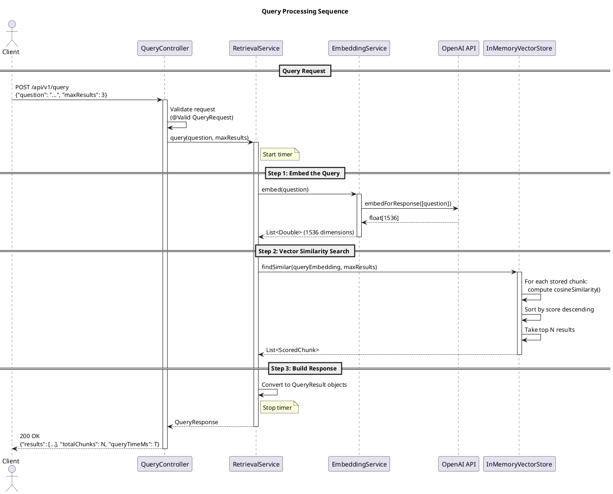
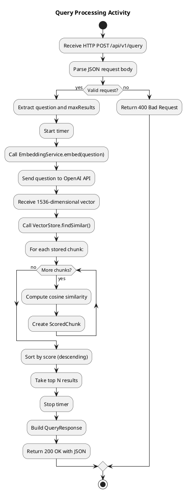
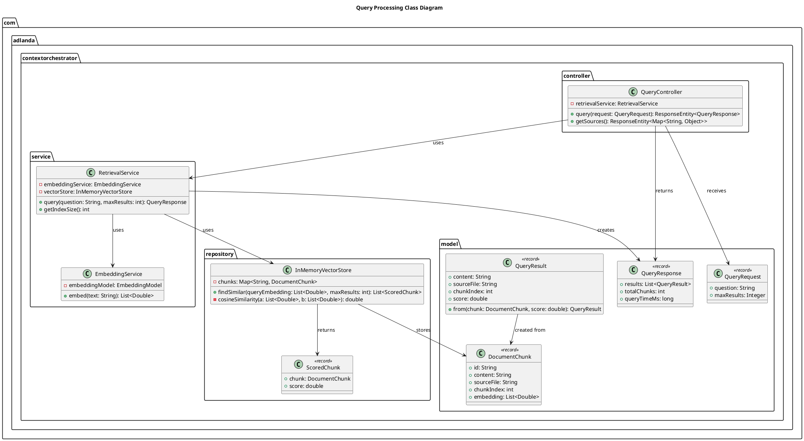
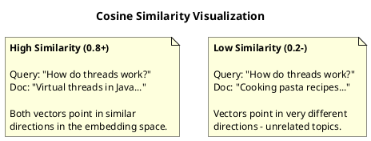

# Query Process

This document explains how queries are processed to retrieve relevant documents from the vector store. It's designed to help developers understand the query pipeline and effectively debug search issues.

---

## Overview

When a user submits a question to the AI Context Orchestrator, the system converts the question into a vector embedding and finds the most semantically similar documents. This process is called **semantic retrieval**.


---

## Sequence Diagram



---

## Classes Involved

The query process involves 6 main classes:

| Class | Package | Responsibility |
|-------|---------|----------------|
| `QueryController` | `com.adlanda.contextorchestrator.controller` | REST endpoint, request validation |
| `RetrievalService` | `com.adlanda.contextorchestrator.service` | Orchestrates the query pipeline |
| `EmbeddingService` | `com.adlanda.contextorchestrator.service` | Converts query text to vector |
| `InMemoryVectorStore` | `com.adlanda.contextorchestrator.repository` | Performs similarity search |
| `QueryRequest` | `com.adlanda.contextorchestrator.model` | Input data model |
| `QueryResponse` | `com.adlanda.contextorchestrator.model` | Output data model |
| `QueryResult` | `com.adlanda.contextorchestrator.model` | Single result data model |

---

## Detailed Class Descriptions

### 1. QueryController

**File:** `src/main/java/com/adlanda/contextorchestrator/controller/QueryController.java`

REST controller that exposes the query API endpoints.

```java
@RestController
@RequestMapping("/api/v1")
public class QueryController {

    @PostMapping("/query")
    public ResponseEntity<QueryResponse> query(@Valid @RequestBody QueryRequest request) {
        QueryResponse response = retrievalService.query(request.question(), request.maxResults());
        return ResponseEntity.ok(response);
    }

    @GetMapping("/sources")
    public ResponseEntity<Map<String, Object>> getSources() {
        // Returns index statistics
    }
}
```

**Endpoints:**

| Method | Path | Description |
|--------|------|-------------|
| POST | `/api/v1/query` | Submit a question and get relevant documents |
| GET | `/api/v1/sources` | Get index statistics (total chunks, status) |

**Key Points:**
- Uses `@Valid` for request validation
- Delegates all business logic to `RetrievalService`
- Returns standardized `QueryResponse` objects

---

### 2. RetrievalService

**File:** `src/main/java/com/adlanda/contextorchestrator/service/RetrievalService.java`

Orchestrates the entire query pipeline: embed → search → format results.

```java
@Service
public class RetrievalService {

    public QueryResponse query(String question, int maxResults) {
        long startTime = System.currentTimeMillis();

        // 1. Embed the query
        List<Double> queryEmbedding = embeddingService.embed(question);

        // 2. Search for similar chunks
        List<ScoredChunk> scoredChunks = vectorStore.findSimilar(queryEmbedding, maxResults);

        // 3. Convert to results
        List<QueryResult> results = scoredChunks.stream()
                .map(sc -> QueryResult.from(sc.chunk(), sc.score()))
                .toList();

        long queryTimeMs = System.currentTimeMillis() - startTime;

        return new QueryResponse(results, vectorStore.size(), queryTimeMs);
    }
}
```

**Key Points:**
- Measures query execution time
- Converts internal `ScoredChunk` to API-friendly `QueryResult`
- Logs query details at DEBUG level

---

### 3. EmbeddingService (Reused from Ingestion)

**File:** `src/main/java/com/adlanda/contextorchestrator/service/EmbeddingService.java`

The same service used during ingestion is reused to embed queries.

```java
@Service
public class EmbeddingService {

    public List<Double> embed(String text) {
        EmbeddingResponse response = embeddingModel.embedForResponse(List.of(text));
        float[] embedding = response.getResult().getOutput();
        return toDoubleList(embedding);
    }
}
```

**Why Reuse Matters:**
- Query and document embeddings must use the **same model**
- Different models produce incompatible vector spaces
- Consistency ensures meaningful similarity scores

---

### 4. InMemoryVectorStore (Similarity Search)

**File:** `src/main/java/com/adlanda/contextorchestrator/repository/InMemoryVectorStore.java`

Performs the actual vector similarity search using cosine similarity.

```java
@Repository
public class InMemoryVectorStore {

    public List<ScoredChunk> findSimilar(List<Double> queryEmbedding, int maxResults) {
        return chunks.values().stream()
                .filter(DocumentChunk::hasEmbedding)
                .map(chunk -> new ScoredChunk(chunk, cosineSimilarity(queryEmbedding, chunk.embedding())))
                .sorted(Comparator.comparingDouble(ScoredChunk::score).reversed())
                .limit(maxResults)
                .toList();
    }

    private double cosineSimilarity(List<Double> a, List<Double> b) {
        // Computes: (a · b) / (||a|| * ||b||)
        double dotProduct = 0.0;
        double normA = 0.0;
        double normB = 0.0;

        for (int i = 0; i < a.size(); i++) {
            dotProduct += a.get(i) * b.get(i);
            normA += a.get(i) * a.get(i);
            normB += b.get(i) * b.get(i);
        }

        return dotProduct / (Math.sqrt(normA) * Math.sqrt(normB));
    }
}
```

**Algorithm Explanation:**

1. **Iterate all stored chunks** - O(n) complexity
2. **Compute cosine similarity** for each chunk against the query
3. **Sort by score** in descending order (highest similarity first)
4. **Take top N** results

**Cosine Similarity Formula:**

```
similarity = (A · B) / (||A|| × ||B||)

Where:
  A · B     = dot product (sum of element-wise multiplication)
  ||A||     = magnitude of vector A (sqrt of sum of squares)
  ||B||     = magnitude of vector B
```

---

### 5. Data Models

#### QueryRequest

**File:** `src/main/java/com/adlanda/contextorchestrator/model/QueryRequest.java`

```java
public record QueryRequest(
    @NotBlank(message = "Question is required")
    String question,

    @Min(1) @Max(20)
    Integer maxResults  // Defaults to 5 if null
) {}
```

#### QueryResponse

**File:** `src/main/java/com/adlanda/contextorchestrator/model/QueryResponse.java`

```java
public record QueryResponse(
    List<QueryResult> results,  // Matched chunks, sorted by relevance
    int totalChunks,            // Total chunks in the index
    long queryTimeMs            // Query execution time
) {}
```

#### QueryResult

**File:** `src/main/java/com/adlanda/contextorchestrator/model/QueryResult.java`

```java
public record QueryResult(
    String content,      // The matched text
    String sourceFile,   // e.g., "spring-ai-guide.md"
    int chunkIndex,      // Position within the source file
    double score         // Similarity score (0.0 to 1.0)
) {}
```

---

## API Reference

### POST /api/v1/query

**Request:**
```json
{
    "question": "How do virtual threads work?",
    "maxResults": 3
}
```

| Field | Type | Required | Default | Constraints |
|-------|------|----------|---------|-------------|
| `question` | string | Yes | - | Non-blank |
| `maxResults` | integer | No | 5 | 1-20 |

**Response:**
```json
{
    "results": [
        {
            "content": "# Virtual Threads in Java 21\n\nVirtual threads are lightweight threads...",
            "sourceFile": "sample.md",
            "chunkIndex": 0,
            "score": 0.5090206963936412
        },
        {
            "content": "## Spring AI Guide\n\nThis guide covers...",
            "sourceFile": "spring-ai-guide.md",
            "chunkIndex": 0,
            "score": 0.2514789012345678
        }
    ],
    "totalChunks": 5,
    "queryTimeMs": 423
}
```

| Field | Type | Description |
|-------|------|-------------|
| `results` | array | Matched chunks, sorted by score descending |
| `results[].content` | string | Full text content of the chunk |
| `results[].sourceFile` | string | Source file path |
| `results[].chunkIndex` | integer | Chunk position in source file |
| `results[].score` | number | Cosine similarity (0.0 - 1.0) |
| `totalChunks` | integer | Total indexed chunks |
| `queryTimeMs` | integer | Query processing time in ms |

### GET /api/v1/sources

**Response:**
```json
{
    "totalChunks": 5,
    "status": "indexed"
}
```

---

## Debugging Guide

### Recommended Breakpoints

| # | Class | Method | Line | What to Inspect |
|---|-------|--------|------|-----------------|
| 1 | `QueryController` | `query()` | 32 | Incoming request, validation |
| 2 | `RetrievalService` | `query()` | 44 | Query embedding result |
| 3 | `EmbeddingService` | `embed()` | 35 | API call to OpenAI |
| 4 | `InMemoryVectorStore` | `findSimilar()` | 50 | All chunks being compared |
| 5 | `InMemoryVectorStore` | `cosineSimilarity()` | 77 | Individual similarity calculation |
| 6 | `RetrievalService` | `query()` | 50 | Scored results before response |

### Step-by-Step Debugging

**To debug a query that returns unexpected results:**

1. **Set breakpoint in `QueryController.query()` at line 32**
   - Inspect: What question is being asked?
   - Check: Is `maxResults` the expected value?

2. **Step into `RetrievalService.query()`**
   - After line 44, inspect `queryEmbedding`
   - Check: Is it a 1536-element list?
   - Verify: Are all values non-null?

3. **Set breakpoint in `InMemoryVectorStore.findSimilar()` at line 50**
   - Inspect: How many chunks are in the store?
   - Check: `chunks.size()` should match expected documents

4. **Step through `cosineSimilarity()` for suspicious results**
   - Compare the query embedding with a specific chunk embedding
   - Check: Are dimensions equal (both 1536)?
   - Verify: Neither vector is all zeros

5. **Back in `RetrievalService.query()` at line 50**
   - Inspect: `scoredChunks` list
   - Check: Are scores in descending order?
   - Verify: Do the top results make sense?

### Common Issues

| Issue | Symptom | Cause | Solution |
|-------|---------|-------|----------|
| Empty results | `results: []` | No documents indexed | Run ingestion first, check startup logs |
| All scores are 0 | Every result has `score: 0.0` | Zero vectors | Check embedding API responses |
| Wrong top result | Irrelevant doc ranked first | Query/doc embedding mismatch | Verify same model for both |
| Slow queries | `queryTimeMs > 1000` | Large index, no optimization | Consider approximate nearest neighbor |
| 400 Bad Request | Validation error | Invalid request body | Check `question` is non-blank |

---

## Activity Diagram



---

## Class Diagram



---

## Understanding Cosine Similarity

### What Is It?

Cosine similarity measures the **angle** between two vectors, not their magnitude. Two vectors pointing in the same direction have a similarity of 1.0, regardless of their length.



### Formula Breakdown

```
cosine_similarity(A, B) = (A · B) / (||A|| × ||B||)
```

**Step-by-step calculation:**

1. **Dot Product (A · B):** Multiply corresponding elements and sum
   ```
   A = [0.1, 0.2, 0.3]
   B = [0.2, 0.1, 0.4]
   A · B = (0.1×0.2) + (0.2×0.1) + (0.3×0.4) = 0.02 + 0.02 + 0.12 = 0.16
   ```

2. **Magnitude ||A||:** Square root of sum of squares
   ```
   ||A|| = sqrt(0.1² + 0.2² + 0.3²) = sqrt(0.14) ≈ 0.374
   ```

3. **Magnitude ||B||:**
   ```
   ||B|| = sqrt(0.2² + 0.1² + 0.4²) = sqrt(0.21) ≈ 0.458
   ```

4. **Final Result:**
   ```
   similarity = 0.16 / (0.374 × 0.458) ≈ 0.934
   ```

### Score Interpretation

| Score Range | Meaning | Example |
|-------------|---------|---------|
| 0.7 - 1.0 | Strong match | Query and document discuss the same specific topic |
| 0.4 - 0.7 | Good match | Related topics, similar domain |
| 0.2 - 0.4 | Weak match | Tangentially related |
| 0.0 - 0.2 | No match | Unrelated content |

---

## Quick Reference: File Locations

```
ai-context-orchestrator/
├── src/main/java/com/adlanda/contextorchestrator/
│   ├── controller/
│   │   └── QueryController.java          # REST endpoint (LINE 32: query())
│   ├── service/
│   │   ├── RetrievalService.java         # Query orchestration (LINE 40: query())
│   │   └── EmbeddingService.java         # Query embedding (LINE 34: embed())
│   ├── repository/
│   │   └── InMemoryVectorStore.java      # Similarity search (LINE 49: findSimilar())
│   └── model/
│       ├── QueryRequest.java             # Input model
│       ├── QueryResponse.java            # Output model
│       └── QueryResult.java              # Single result model
```

---

## Summary

The query process follows a clear 3-step pipeline:

1. **Embed Query** (`EmbeddingService`): Convert the question text into a 1536-dimensional vector using the same OpenAI model used for documents
2. **Similarity Search** (`InMemoryVectorStore`): Compare the query vector against all stored document vectors using cosine similarity
3. **Return Results** (`RetrievalService`): Sort by score, take top N, and return as structured JSON response

**Key Insight:** The query and document embeddings must be generated by the **same model** for similarity scores to be meaningful. The system uses `text-embedding-3-small` for both.

To debug effectively:
- Start at `QueryController.query()` and step through
- Verify the query embedding has 1536 dimensions
- Check similarity scores in `findSimilar()`
- Confirm results are sorted correctly