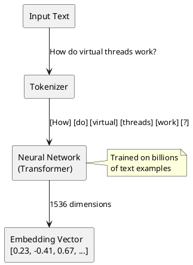
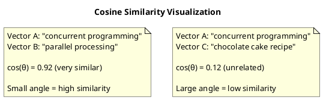
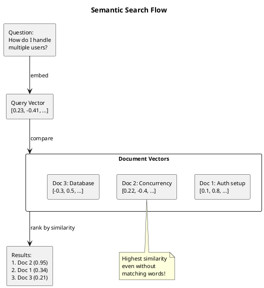
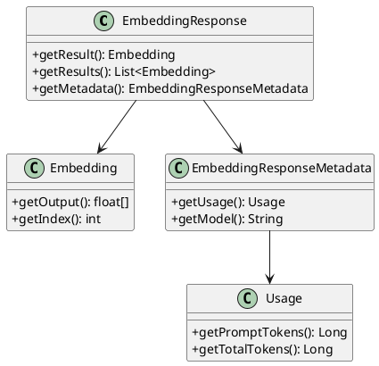

# Spring AI Usage in the Context Orchestrator

This document explains how Spring AI is used in Iteration 1 to integrate with OpenAI's embedding API.

## Understanding Embeddings: The Foundation

Before diving into Spring AI, let's understand what embeddings are and why they matter.

### The Problem: Computers Don't Understand Meaning

Traditional search works by matching exact words. If you search for "car", you find documents containing "car". But what about "automobile", "vehicle", or "Tesla Model 3"? These are semantically related, but keyword search misses the connection.

```
Query: "How do I handle multiple users?"

Keyword search finds:
  ✓ "handle multiple users"
  ✗ "concurrent request processing"  (no matching words!)
  ✗ "scaling for many connections"   (no matching words!)
```

### The Solution: Represent Meaning as Numbers

An **embedding** is a way to convert text into a list of numbers (a vector) that captures its meaning. The key insight:

> Texts with similar meanings produce similar vectors.

```
"How do I handle multiple users?"    → [0.23, -0.41, 0.67, 0.12, ...]
"concurrent request processing"      → [0.21, -0.39, 0.65, 0.14, ...]  ← Similar!
"the weather is nice today"          → [-0.15, 0.82, -0.34, 0.91, ...] ← Different
```

### How Embedding Models Work

Embedding models are neural networks trained on massive amounts of text. They learn patterns like:

- "king" - "man" + "woman" ≈ "queen"
- "Paris" is to "France" as "Tokyo" is to "Japan"
- "happy", "joyful", "elated" cluster together

When you give text to an embedding model, it:

1. **Tokenizes** the text (breaks it into pieces)
2. **Processes** each token through neural network layers
3. **Outputs** a fixed-size vector (e.g., 1536 numbers)



### Why 1536 Dimensions?

Each dimension captures some aspect of meaning. You can think of it like coordinates in a high-dimensional space:

| Dimension | Might Capture (simplified) |
|-----------|---------------------------|
| Dim 1 | Technical vs. casual tone |
| Dim 2 | Past vs. future tense |
| Dim 3 | Positive vs. negative sentiment |
| ... | ... |
| Dim 1536 | Some abstract concept |

In reality, dimensions don't map to human-interpretable concepts. They're learned features that help distinguish between different meanings.

### Cosine Similarity: Measuring "Closeness"

Once we have vectors, we need to measure how similar they are. **Cosine similarity** looks at the angle between two vectors:

- **1.0** = Identical direction (same meaning)
- **0.0** = Perpendicular (unrelated)
- **-1.0** = Opposite direction (opposite meaning)



The formula:
```
cosine_similarity(A, B) = (A · B) / (||A|| × ||B||)
```

Where `A · B` is the dot product and `||A||` is the magnitude (length) of vector A.

### Why This Enables Semantic Search

With embeddings, our search process becomes:

1. **Index time**: Convert all documents to vectors
2. **Query time**: Convert the question to a vector
3. **Search**: Find document vectors closest to the query vector



### The Trade-offs

| Advantage | Disadvantage |
|-----------|--------------|
| Finds semantically related content | Requires API calls (cost, latency) |
| Works across languages | Can miss exact keyword matches |
| No need to define synonyms manually | "Black box" - hard to debug |
| Improves with better models | Model quality affects results |

## What is Spring AI?

Spring AI is the official Spring framework for integrating AI/ML capabilities into Spring Boot applications. It provides:

- Unified abstractions for different AI providers (OpenAI, Azure, Ollama, etc.)
- Auto-configuration for common setups
- Type-safe APIs for embeddings, chat, and other AI operations

Think of it as "Spring Data for AI" - it standardizes how you interact with AI services, making it easy to switch providers later.

## Dependencies

### Maven Configuration

```xml
<!-- Spring AI BOM (Bill of Materials) -->
<dependencyManagement>
    <dependencies>
        <dependency>
            <groupId>org.springframework.ai</groupId>
            <artifactId>spring-ai-bom</artifactId>
            <version>1.0.0-M4</version>
            <type>pom</type>
            <scope>import</scope>
        </dependency>
    </dependencies>
</dependencyManagement>

<!-- OpenAI Starter -->
<dependencies>
    <dependency>
        <groupId>org.springframework.ai</groupId>
        <artifactId>spring-ai-openai-spring-boot-starter</artifactId>
    </dependency>
</dependencies>

<!-- Spring Milestones Repository (required for M4 releases) -->
<repositories>
    <repository>
        <id>spring-milestones</id>
        <url>https://repo.spring.io/milestone</url>
    </repository>
</repositories>
```

The BOM manages version compatibility across Spring AI modules. The OpenAI starter auto-configures the `EmbeddingModel` bean.

## Configuration

### application.properties

```properties
# API Key (from environment variable)
spring.ai.openai.api-key=${OPENAI_API_KEY:your-api-key-here}

# Embedding model selection
spring.ai.openai.embedding.options.model=text-embedding-3-small
```

### Available Embedding Models

| Model | Dimensions | Cost (per 1M tokens) | Notes |
|-------|------------|----------------------|-------|
| `text-embedding-3-small` | 1536 | $0.02 | Best for most use cases |
| `text-embedding-3-large` | 3072 | $0.13 | Higher quality, more expensive |
| `text-embedding-ada-002` | 1536 | $0.10 | Legacy model |

We use `text-embedding-3-small` because it offers excellent quality at low cost.

## The EmbeddingModel Interface

Spring AI provides the `EmbeddingModel` interface as an abstraction over embedding providers:

```java
public interface EmbeddingModel {
    // Embed a single text
    EmbeddingResponse embedForResponse(List<String> texts);

    // Convenience method for single text
    float[] embed(String text);

    // Embed multiple texts
    List<float[]> embed(List<String> texts);
}
```

Spring Boot auto-configures an `OpenAiEmbeddingModel` implementation when you include the OpenAI starter and provide an API key.

## How We Use It

### EmbeddingService Implementation

```java
@Service
public class EmbeddingService {

    private final EmbeddingModel embeddingModel;

    // Spring injects the auto-configured OpenAiEmbeddingModel
    public EmbeddingService(EmbeddingModel embeddingModel) {
        this.embeddingModel = embeddingModel;
    }

    public List<Double> embed(String text) {
        // Call OpenAI's embedding API
        EmbeddingResponse response = embeddingModel.embedForResponse(List.of(text));

        // Extract the embedding vector
        float[] embedding = response.getResult().getOutput();

        // Convert to List<Double> for our domain model
        return toDoubleList(embedding);
    }
}
```

### What Happens Under the Hood

When you call `embeddingModel.embedForResponse(List.of("some text"))`:

1. Spring AI serializes the request to JSON
2. Makes an HTTP POST to `https://api.openai.com/v1/embeddings`
3. Includes your API key in the `Authorization` header
4. Parses the response and extracts the embedding vector

The request looks like:
```json
{
  "model": "text-embedding-3-small",
  "input": ["some text"]
}
```

The response contains:
```json
{
  "object": "list",
  "data": [
    {
      "object": "embedding",
      "index": 0,
      "embedding": [0.023, -0.041, 0.067, ...]  // 1536 floats
    }
  ],
  "model": "text-embedding-3-small",
  "usage": {
    "prompt_tokens": 2,
    "total_tokens": 2
  }
}
```

## The Response Structure



## Testing with Mocks

Since we don't want to call the real OpenAI API in tests, we mock the `EmbeddingModel`:

```java
@SpringBootTest
class OrchestratorApplicationTests {

    @TestConfiguration
    static class TestConfig {
        @Bean
        @Primary
        public EmbeddingModel embeddingModel() {
            EmbeddingModel mockModel = mock(EmbeddingModel.class);

            // Return a fake 1536-dimension vector
            float[] mockEmbedding = new float[1536];
            when(mockModel.embedForResponse(anyList()))
                .thenReturn(new EmbeddingResponse(
                    List.of(new Embedding(mockEmbedding, 0))
                ));

            return mockModel;
        }
    }
}
```

The `@Primary` annotation ensures our mock takes precedence over the auto-configured bean.

## Virtual Threads Integration

We enable virtual threads in `application.properties`:

```properties
spring.threads.virtual.enabled=true
```

This is particularly valuable for embedding operations because:

1. **Embedding calls are I/O-bound**: The thread waits for OpenAI's API response
2. **Virtual threads are cheap**: We can have thousands without exhausting memory
3. **No code changes needed**: Spring automatically uses virtual threads for request handling

When processing many chunks, each embedding call can run on its own virtual thread without blocking platform threads.

## Error Handling

Spring AI throws specific exceptions for different failure scenarios:

| Exception | When It Occurs |
|-----------|----------------|
| `ApiKeyNotConfiguredException` | Missing or invalid API key |
| `RateLimitException` | Too many requests to OpenAI |
| `ResourceNotFoundException` | Invalid model name |
| `ServiceUnavailableException` | OpenAI service is down |

In Iteration 1, we let these propagate. Future iterations will add retry logic and graceful degradation.

## Cost Awareness

Each embedding call costs money. Here's a rough estimate:

| Scenario | Tokens | Cost |
|----------|--------|------|
| 1 paragraph (~100 words) | ~130 tokens | $0.0000026 |
| 1 page (~500 words) | ~650 tokens | $0.000013 |
| 100 pages | ~65,000 tokens | $0.0013 |

At ~$0.02 per million tokens, costs are minimal for most projects. But be aware:
- Re-indexing on every startup regenerates all embeddings
- Large document sets can add up
- Iteration 2's persistent storage will eliminate redundant API calls

## What Spring AI Doesn't Do (Yet)

In Iteration 1, we implement these ourselves:

| Feature | Our Implementation | Future Spring AI Support? |
|---------|-------------------|---------------------------|
| Vector storage | `InMemoryVectorStore` | Spring AI has `VectorStore` interface |
| Similarity search | Manual cosine similarity | Built into `VectorStore` implementations |
| Document chunking | `IngestionService` | `DocumentTransformer` API exists |

Future iterations may migrate to Spring AI's built-in `VectorStore` abstraction, which supports PGVector, Redis, and other backends.

## Summary

Spring AI simplifies OpenAI integration to:

1. **Add dependency**: `spring-ai-openai-spring-boot-starter`
2. **Configure API key**: `spring.ai.openai.api-key`
3. **Inject and use**: `EmbeddingModel` bean is auto-configured

The abstraction layer means we could switch to Azure OpenAI, Ollama (local), or another provider by changing dependencies and configuration - no code changes required.
