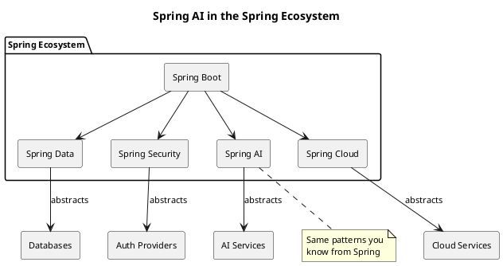
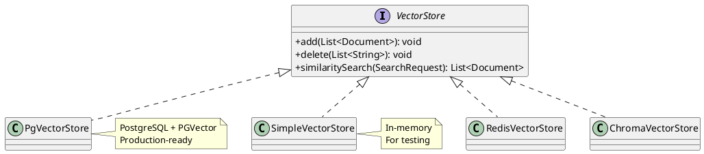
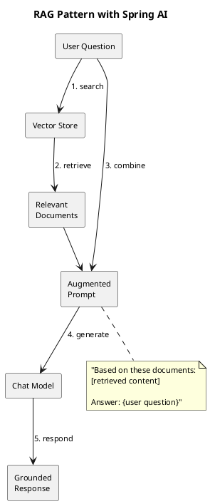

# Introduction to Spring AI

A comprehensive guide to understanding and using Spring AI for building AI-powered applications.

## What is Spring AI?

Spring AI is the official Spring framework for integrating artificial intelligence capabilities into Java applications. Announced in 2023 and actively developed by the Spring team at VMware/Broadcom, it brings the familiar Spring programming model to AI development.

Think of Spring AI as **"Spring Data for AI"** - just as Spring Data provides a consistent way to access databases, Spring AI provides a consistent way to access AI services.



## Why Spring AI?

### The Problem It Solves

Before Spring AI, integrating AI services into Java applications meant:

1. **Manual HTTP clients**: Writing REST calls to OpenAI, Azure, etc.
2. **JSON parsing**: Handling request/response serialization yourself
3. **No abstraction**: Code tightly coupled to specific providers
4. **Boilerplate**: Repeating similar patterns across projects

```java
// Without Spring AI - tedious and error-prone
HttpClient client = HttpClient.newHttpClient();
String json = """
    {"model": "gpt-4", "messages": [{"role": "user", "content": "Hello"}]}
    """;
HttpRequest request = HttpRequest.newBuilder()
    .uri(URI.create("https://api.openai.com/v1/chat/completions"))
    .header("Authorization", "Bearer " + apiKey)
    .header("Content-Type", "application/json")
    .POST(HttpRequest.BodyPublishers.ofString(json))
    .build();
HttpResponse<String> response = client.send(request, HttpResponse.BodyHandlers.ofString());
// Now parse the JSON response manually...
```

### The Spring AI Solution

Spring AI provides:

1. **Auto-configuration**: Add a dependency, set properties, get working beans
2. **Unified abstractions**: Same code works with different providers
3. **Type safety**: Java interfaces instead of raw JSON
4. **Spring integration**: Works with dependency injection, properties, profiles

```java
// With Spring AI - clean and simple
@Service
public class ChatService {
    private final ChatModel chatModel;

    public ChatService(ChatModel chatModel) {
        this.chatModel = chatModel;  // Auto-configured!
    }

    public String chat(String message) {
        return chatModel.call(message);
    }
}
```

## Core Concepts

### 1. Models

Spring AI abstracts AI capabilities into **model** interfaces:

```plantuml
@startuml
skinparam backgroundColor white
skinparam classAttributeIconSize 0

interface "ChatModel" as chat {
    +call(Prompt): ChatResponse
    +call(String): String
    +stream(Prompt): Flux<ChatResponse>
}

interface "EmbeddingModel" as embed {
    +embed(String): float[]
    +embed(List<String>): List<float[]>
    +embedForResponse(List<String>): EmbeddingResponse
}

interface "ImageModel" as image {
    +call(ImagePrompt): ImageResponse
}

interface "AudioModel" as audio {
    +call(AudioPrompt): AudioResponse
}

note right of chat
  Text generation
  (GPT-4, Claude, etc.)
end note

note right of embed
  Vector embeddings
  for semantic search
end note

note right of image
  Image generation
  (DALL-E, Midjourney)
end note

note right of audio
  Speech-to-text
  Text-to-speech
end note

@enduml
```



Each model type has implementations for different providers:

| Model Type | OpenAI | Azure | Ollama | Anthropic |
|------------|--------|-------|--------|-----------|
| ChatModel | OpenAiChatModel | AzureOpenAiChatModel | OllamaChatModel | AnthropicChatModel |
| EmbeddingModel | OpenAiEmbeddingModel | AzureOpenAiEmbeddingModel | OllamaEmbeddingModel | - |
| ImageModel | OpenAiImageModel | AzureOpenAiImageModel | - | - |

### 2. Prompts and Messages

A **Prompt** is what you send to a model. It contains **Messages**:

```java
// Simple string prompt
String response = chatModel.call("What is Spring AI?");

// Structured prompt with messages
List<Message> messages = List.of(
    new SystemMessage("You are a helpful coding assistant."),
    new UserMessage("Explain virtual threads in Java 21.")
);
Prompt prompt = new Prompt(messages);
ChatResponse response = chatModel.call(prompt);
```

Message types:

| Type | Purpose | Example |
|------|---------|---------|
| `SystemMessage` | Set AI behavior/persona | "You are a Java expert" |
| `UserMessage` | User's input | "How do I use streams?" |
| `AssistantMessage` | AI's previous response | For conversation history |
| `FunctionMessage` | Tool/function results | Return value from a function call |

### 3. Responses

Models return structured **Response** objects:

```java
ChatResponse response = chatModel.call(prompt);

// Get the generated text
String text = response.getResult().getOutput().getContent();

// Access metadata
ChatResponseMetadata metadata = response.getMetadata();
Usage usage = metadata.getUsage();
System.out.println("Tokens used: " + usage.getTotalTokens());
```

### 4. Options

Configure model behavior with **Options**:

```java
ChatOptions options = ChatOptionsBuilder.builder()
    .withTemperature(0.7f)      // Creativity (0.0 = deterministic, 1.0 = creative)
    .withMaxTokens(500)         // Response length limit
    .withTopP(0.9f)             // Nucleus sampling
    .build();

Prompt prompt = new Prompt("Write a poem about Java", options);
```

Common options:

| Option | What It Does | Typical Values |
|--------|--------------|----------------|
| `temperature` | Controls randomness | 0.0 - 1.0 |
| `maxTokens` | Limits response length | 100 - 4000 |
| `topP` | Nucleus sampling threshold | 0.1 - 1.0 |
| `topK` | Limits token choices | 1 - 100 |
| `stopSequences` | Strings that stop generation | ["\n\n", "END"] |

## Getting Started

### Step 1: Add Dependencies

For Maven with OpenAI:

```xml
<dependencyManagement>
    <dependencies>
        <dependency>
            <groupId>org.springframework.ai</groupId>
            <artifactId>spring-ai-bom</artifactId>
            <version>1.0.0-M4</version>
            <type>pom</type>
            <scope>import</scope>
        </dependency>
    </dependencies>
</dependencyManagement>

<dependencies>
    <dependency>
        <groupId>org.springframework.ai</groupId>
        <artifactId>spring-ai-openai-spring-boot-starter</artifactId>
    </dependency>
</dependencies>

<repositories>
    <repository>
        <id>spring-milestones</id>
        <url>https://repo.spring.io/milestone</url>
    </repository>
</repositories>
```

For Gradle:

```groovy
repositories {
    maven { url 'https://repo.spring.io/milestone' }
}

dependencies {
    implementation platform("org.springframework.ai:spring-ai-bom:1.0.0-M4")
    implementation 'org.springframework.ai:spring-ai-openai-spring-boot-starter'
}
```

### Step 2: Configure

In `application.properties`:

```properties
# API Key (use environment variable in production!)
spring.ai.openai.api-key=${OPENAI_API_KEY}

# Chat model configuration
spring.ai.openai.chat.options.model=gpt-4
spring.ai.openai.chat.options.temperature=0.7

# Embedding model configuration
spring.ai.openai.embedding.options.model=text-embedding-3-small
```

### Step 3: Use

```java
@RestController
@RequestMapping("/api/chat")
public class ChatController {

    private final ChatModel chatModel;

    public ChatController(ChatModel chatModel) {
        this.chatModel = chatModel;
    }

    @PostMapping
    public String chat(@RequestBody String message) {
        return chatModel.call(message);
    }
}
```

That's it! Spring Boot auto-configures the `ChatModel` bean based on your dependencies and properties.

## Supported Providers

Spring AI supports multiple AI providers through different starters:

### OpenAI

```xml
<dependency>
    <groupId>org.springframework.ai</groupId>
    <artifactId>spring-ai-openai-spring-boot-starter</artifactId>
</dependency>
```

```properties
spring.ai.openai.api-key=${OPENAI_API_KEY}
spring.ai.openai.chat.options.model=gpt-4
```

### Azure OpenAI

```xml
<dependency>
    <groupId>org.springframework.ai</groupId>
    <artifactId>spring-ai-azure-openai-spring-boot-starter</artifactId>
</dependency>
```

```properties
spring.ai.azure.openai.api-key=${AZURE_OPENAI_API_KEY}
spring.ai.azure.openai.endpoint=${AZURE_OPENAI_ENDPOINT}
spring.ai.azure.openai.chat.options.deployment-name=my-gpt4-deployment
```

### Ollama (Local Models)

```xml
<dependency>
    <groupId>org.springframework.ai</groupId>
    <artifactId>spring-ai-ollama-spring-boot-starter</artifactId>
</dependency>
```

```properties
spring.ai.ollama.base-url=http://localhost:11434
spring.ai.ollama.chat.options.model=llama2
```

### Anthropic (Claude)

```xml
<dependency>
    <groupId>org.springframework.ai</groupId>
    <artifactId>spring-ai-anthropic-spring-boot-starter</artifactId>
</dependency>
```

```properties
spring.ai.anthropic.api-key=${ANTHROPIC_API_KEY}
spring.ai.anthropic.chat.options.model=claude-3-opus-20240229
```

## Working with Embeddings

Embeddings convert text into vectors for semantic search. This is fundamental for RAG (Retrieval Augmented Generation) applications.

### Basic Usage

```java
@Service
public class EmbeddingService {

    private final EmbeddingModel embeddingModel;

    public EmbeddingService(EmbeddingModel embeddingModel) {
        this.embeddingModel = embeddingModel;
    }

    public float[] getEmbedding(String text) {
        return embeddingModel.embed(text);
    }

    public List<float[]> getEmbeddings(List<String> texts) {
        return embeddingModel.embed(texts);
    }
}
```

### With Response Metadata

```java
public EmbeddingResponse getEmbeddingWithMetadata(String text) {
    EmbeddingResponse response = embeddingModel.embedForResponse(List.of(text));

    // Access the embedding
    float[] vector = response.getResult().getOutput();

    // Access metadata
    EmbeddingResponseMetadata metadata = response.getMetadata();
    System.out.println("Model: " + metadata.getModel());
    System.out.println("Tokens: " + metadata.getUsage().getTotalTokens());

    return response;
}
```

## Vector Stores

Spring AI provides a `VectorStore` abstraction for storing and searching embeddings:



### Using a Vector Store

```java
@Service
public class DocumentService {

    private final VectorStore vectorStore;

    public DocumentService(VectorStore vectorStore) {
        this.vectorStore = vectorStore;
    }

    public void indexDocument(String content, Map<String, Object> metadata) {
        Document doc = new Document(content, metadata);
        vectorStore.add(List.of(doc));
    }

    public List<Document> search(String query) {
        SearchRequest request = SearchRequest.query(query)
            .withTopK(5)
            .withSimilarityThreshold(0.7);

        return vectorStore.similaritySearch(request);
    }
}
```

### PGVector Configuration

```xml
<dependency>
    <groupId>org.springframework.ai</groupId>
    <artifactId>spring-ai-pgvector-store-spring-boot-starter</artifactId>
</dependency>
```

```properties
spring.datasource.url=jdbc:postgresql://localhost:5432/vectordb
spring.datasource.username=postgres
spring.datasource.password=password
spring.ai.vectorstore.pgvector.dimensions=1536
```

## Function Calling

Spring AI supports function calling, allowing AI models to invoke your Java methods:

```java
// 1. Define a function
public class WeatherService {
    public String getWeather(String location) {
        // Call weather API...
        return "Sunny, 72°F in " + location;
    }
}

// 2. Register as a function callback
@Configuration
public class FunctionConfig {

    @Bean
    public FunctionCallback weatherFunction() {
        return FunctionCallbackWrapper.builder(new WeatherService())
            .withName("getWeather")
            .withDescription("Get current weather for a location")
            .withInputType(String.class)
            .build();
    }
}

// 3. Use with chat model
@Service
public class AssistantService {

    private final ChatModel chatModel;
    private final FunctionCallback weatherFunction;

    public String askAboutWeather(String question) {
        Prompt prompt = new Prompt(
            question,
            OpenAiChatOptions.builder()
                .withFunctions(Set.of("getWeather"))
                .build()
        );
        return chatModel.call(prompt).getResult().getOutput().getContent();
    }
}
```

When you ask "What's the weather in Tokyo?", the model will:
1. Recognize it needs weather data
2. Call `getWeather("Tokyo")`
3. Use the result to form its response

## Streaming Responses

For real-time responses (like ChatGPT's typing effect):

```java
@Service
public class StreamingChatService {

    private final ChatModel chatModel;

    public Flux<String> streamChat(String message) {
        Prompt prompt = new Prompt(message);

        return chatModel.stream(prompt)
            .map(response -> response.getResult().getOutput().getContent())
            .filter(content -> content != null);
    }
}

// In a controller
@GetMapping(value = "/stream", produces = MediaType.TEXT_EVENT_STREAM_VALUE)
public Flux<String> streamResponse(@RequestParam String message) {
    return streamingChatService.streamChat(message);
}
```

## Output Parsing

Convert AI responses into Java objects:

```java
// Define your output type
public record MovieReview(
    String title,
    int rating,
    String summary,
    List<String> pros,
    List<String> cons
) {}

// Use a parser
@Service
public class ReviewService {

    private final ChatModel chatModel;

    public MovieReview parseReview(String movieName) {
        BeanOutputParser<MovieReview> parser = new BeanOutputParser<>(MovieReview.class);

        String prompt = """
            Review the movie "%s".
            %s
            """.formatted(movieName, parser.getFormat());

        String response = chatModel.call(prompt);
        return parser.parse(response);
    }
}
```

## RAG (Retrieval Augmented Generation)

Combine vector search with chat for knowledge-grounded responses:



```java
@Service
public class RagService {

    private final VectorStore vectorStore;
    private final ChatModel chatModel;

    public String askWithContext(String question) {
        // 1. Search for relevant documents
        List<Document> relevantDocs = vectorStore.similaritySearch(
            SearchRequest.query(question).withTopK(3)
        );

        // 2. Build context from documents
        String context = relevantDocs.stream()
            .map(Document::getContent)
            .collect(Collectors.joining("\n\n"));

        // 3. Create augmented prompt
        String augmentedPrompt = """
            Based on the following context, answer the question.
            If the answer isn't in the context, say "I don't know."

            Context:
            %s

            Question: %s
            """.formatted(context, question);

        // 4. Get response from chat model
        return chatModel.call(augmentedPrompt);
    }
}
```

## Observability

Spring AI integrates with Spring's observability stack:

```properties
# Enable metrics
management.endpoints.web.exposure.include=health,metrics,prometheus

# Enable tracing (with Micrometer)
management.tracing.sampling.probability=1.0
```

Available metrics:
- `spring.ai.chat.tokens` - Token usage
- `spring.ai.chat.latency` - Response time
- `spring.ai.embedding.tokens` - Embedding token usage

## Best Practices

### 1. Externalize API Keys

Never hardcode API keys:

```properties
# Good - from environment
spring.ai.openai.api-key=${OPENAI_API_KEY}

# Bad - hardcoded
spring.ai.openai.api-key=sk-abc123...
```

### 2. Use Profiles for Different Providers

```properties
# application-dev.properties (local Ollama)
spring.ai.ollama.base-url=http://localhost:11434
spring.ai.ollama.chat.options.model=llama2

# application-prod.properties (OpenAI)
spring.ai.openai.api-key=${OPENAI_API_KEY}
spring.ai.openai.chat.options.model=gpt-4
```

### 3. Handle Errors Gracefully

```java
@Service
public class ResilientChatService {

    private final ChatModel chatModel;

    public String chat(String message) {
        try {
            return chatModel.call(message);
        } catch (RateLimitException e) {
            // Back off and retry
            return retryWithBackoff(message);
        } catch (ServiceUnavailableException e) {
            // Return cached or fallback response
            return "Service temporarily unavailable. Please try again.";
        }
    }
}
```

### 4. Monitor Costs

```java
@Aspect
@Component
public class TokenUsageAspect {

    private final MeterRegistry meterRegistry;

    @AfterReturning(
        pointcut = "execution(* org.springframework.ai.chat.ChatModel.call(..))",
        returning = "response"
    )
    public void trackTokenUsage(ChatResponse response) {
        Usage usage = response.getMetadata().getUsage();
        meterRegistry.counter("ai.tokens.total")
            .increment(usage.getTotalTokens());
    }
}
```

### 5. Test Without API Calls

```java
@SpringBootTest
class ChatServiceTest {

    @MockBean
    private ChatModel chatModel;

    @Autowired
    private ChatService chatService;

    @Test
    void shouldReturnResponse() {
        when(chatModel.call(anyString())).thenReturn("Mocked response");

        String result = chatService.chat("Hello");

        assertThat(result).isEqualTo("Mocked response");
    }
}
```

## Summary

Spring AI brings AI capabilities to Java with the patterns Spring developers know:

| Spring Pattern | Spring AI Application |
|----------------|----------------------|
| Auto-configuration | AI model beans configured from properties |
| Dependency injection | Inject `ChatModel`, `EmbeddingModel`, etc. |
| Abstraction | Same interface for OpenAI, Azure, Ollama |
| Properties | Configure models, temperatures, tokens |
| Profiles | Switch providers per environment |
| Testing | Mock AI models like any Spring bean |

The framework is evolving rapidly. Check the [official documentation](https://docs.spring.io/spring-ai/reference/) for the latest features.

## Further Reading

- [Spring AI Reference Documentation](https://docs.spring.io/spring-ai/reference/)
- [Spring AI GitHub Repository](https://github.com/spring-projects/spring-ai)
- [Spring AI Samples](https://github.com/spring-projects/spring-ai/tree/main/spring-ai-samples)
- [Spring Blog - Spring AI Posts](https://spring.io/blog)
