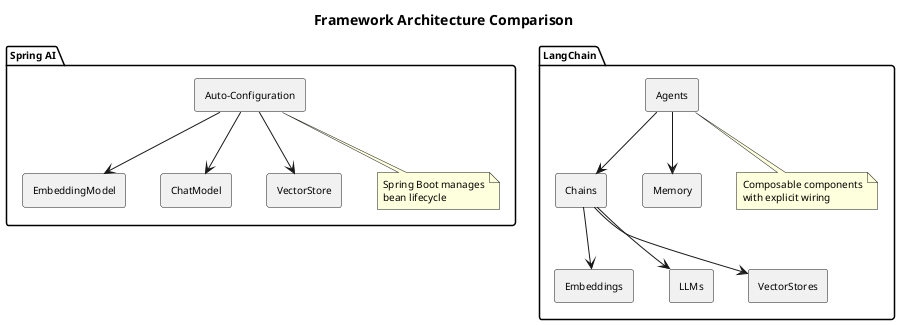
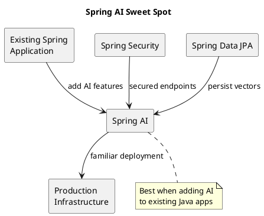
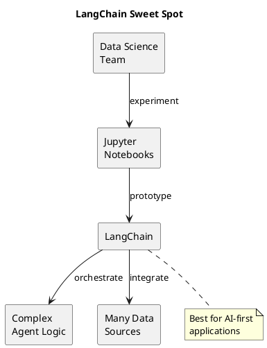
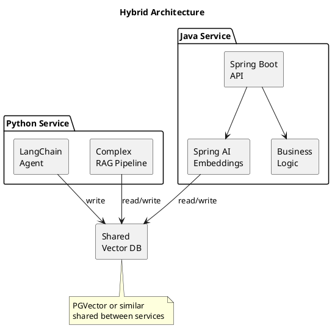

# Spring AI vs LangChain: A Comparison

This document compares two popular frameworks for building AI-powered applications: Spring AI (Java) and LangChain (Python/JavaScript).

## Overview

| Aspect | Spring AI | LangChain |
|--------|-----------|-----------|
| **Language** | Java | Python, JavaScript/TypeScript |
| **Ecosystem** | Spring Framework | Standalone (integrates with many) |
| **Maturity** | Early (1.0.0-M4) | More mature (0.1.x, rapidly evolving) |
| **Philosophy** | Convention over configuration | Flexibility and composability |
| **Primary audience** | Enterprise Java developers | Data scientists, startups, polyglot teams |

## Architecture Comparison



## Key Differences

### 1. Configuration Style

**Spring AI** uses Spring Boot's auto-configuration. Add a dependency and properties, get a working bean:

```java
// Just inject - Spring configures everything
@Service
public class MyService {
    private final EmbeddingModel embeddingModel;

    public MyService(EmbeddingModel embeddingModel) {
        this.embeddingModel = embeddingModel;
    }
}
```

```properties
spring.ai.openai.api-key=${OPENAI_API_KEY}
spring.ai.openai.embedding.options.model=text-embedding-3-small
```

**LangChain** requires explicit instantiation and wiring:

```python
from langchain_openai import OpenAIEmbeddings
from langchain_community.vectorstores import Chroma

# Explicit configuration
embeddings = OpenAIEmbeddings(
    model="text-embedding-3-small",
    openai_api_key=os.environ["OPENAI_API_KEY"]
)

vectorstore = Chroma(
    embedding_function=embeddings,
    persist_directory="./chroma_db"
)
```

### 2. Abstraction Level

**Spring AI** provides high-level abstractions that hide complexity:

```java
// Simple, but less control
List<Double> embedding = embeddingModel.embed("some text");
```

**LangChain** offers more granular control with chains and callbacks:

```python
from langchain.callbacks import StreamingStdOutCallbackHandler

# Fine-grained control over execution
chain = LLMChain(
    llm=ChatOpenAI(streaming=True, callbacks=[StreamingStdOutCallbackHandler()]),
    prompt=prompt_template,
    verbose=True
)
```

### 3. Agent Capabilities

**LangChain** has mature agent support with tools, memory, and reasoning:

```python
from langchain.agents import create_openai_functions_agent, AgentExecutor
from langchain.tools import Tool

tools = [
    Tool(name="Search", func=search_func, description="Search the web"),
    Tool(name="Calculator", func=calc_func, description="Do math"),
]

agent = create_openai_functions_agent(llm, tools, prompt)
executor = AgentExecutor(agent=agent, tools=tools, memory=memory)
```

**Spring AI** has basic function calling but agents are still developing:

```java
// Function calling exists but agent orchestration is limited
@Bean
public FunctionCallback weatherFunction() {
    return FunctionCallbackWrapper.builder(new WeatherService())
        .withName("getWeather")
        .withDescription("Get weather for a location")
        .build();
}
```

### 4. RAG Implementation

**Spring AI** approach (what we use in the Context Orchestrator):

```java
@Service
public class RetrievalService {
    private final EmbeddingModel embeddingModel;
    private final VectorStore vectorStore;

    public List<Document> search(String query) {
        return vectorStore.similaritySearch(
            SearchRequest.query(query).withTopK(5)
        );
    }
}
```

**LangChain** approach with retrieval chains:

```python
from langchain.chains import RetrievalQA

qa_chain = RetrievalQA.from_chain_type(
    llm=ChatOpenAI(),
    chain_type="stuff",
    retriever=vectorstore.as_retriever(search_kwargs={"k": 5}),
    return_source_documents=True
)

result = qa_chain({"query": "How do virtual threads work?"})
```

### 5. Memory and Conversation

**LangChain** has built-in conversation memory:

```python
from langchain.memory import ConversationBufferMemory

memory = ConversationBufferMemory(
    memory_key="chat_history",
    return_messages=True
)

chain = ConversationChain(llm=llm, memory=memory)
chain.predict(input="Hello!")
chain.predict(input="What did I just say?")  # Remembers context
```

**Spring AI** requires manual conversation management:

```java
// You manage the message history yourself
List<Message> messages = new ArrayList<>();
messages.add(new UserMessage("Hello!"));
ChatResponse response = chatModel.call(new Prompt(messages));
messages.add(response.getResult().getOutput());
// Continue adding messages...
```

## Feature Matrix

| Feature | Spring AI | LangChain |
|---------|-----------|-----------|
| **Embeddings** | Full support | Full support |
| **Chat/LLM** | Full support | Full support |
| **Vector stores** | Growing (PGVector, Redis, Chroma) | Extensive (50+) |
| **Document loaders** | Basic | Extensive (PDF, HTML, etc.) |
| **Text splitters** | Basic | Many strategies |
| **Chains** | Limited | Core feature |
| **Agents** | Basic | Mature |
| **Memory** | Manual | Built-in |
| **Callbacks/Streaming** | Supported | Mature |
| **Evaluation** | Limited | LangSmith integration |
| **Observability** | Spring Actuator | LangSmith, callbacks |

## When to Choose Spring AI

Choose Spring AI when:

1. **You're in a Java/Spring ecosystem**: Integrates naturally with existing Spring Boot applications
2. **Enterprise requirements**: Need Spring Security, Spring Data, Spring Cloud integration
3. **Convention over configuration**: Want auto-configuration and minimal boilerplate
4. **Production Java deployments**: Existing DevOps for Java applications
5. **Type safety matters**: Compile-time checking, IDE support, refactoring tools



## When to Choose LangChain

Choose LangChain when:

1. **Rapid prototyping**: Quickly test AI concepts and chains
2. **Complex agent workflows**: Need sophisticated multi-step reasoning
3. **Python data science stack**: Integrating with pandas, numpy, jupyter
4. **Maximum flexibility**: Need fine-grained control over every component
5. **Cutting-edge features**: Want the latest AI patterns immediately



## Hybrid Approach

You don't have to choose one exclusively. A common pattern:



Use LangChain for:
- Experimental agent workflows
- Data science team prototypes
- Complex document processing pipelines

Use Spring AI for:
- Production API endpoints
- Integration with existing Java services
- Enterprise security and compliance

## Code Comparison: Same Task

**Task**: Embed text and search a vector store

### Spring AI

```java
@Service
public class SearchService {
    private final EmbeddingModel embeddingModel;
    private final VectorStore vectorStore;

    public SearchService(EmbeddingModel embeddingModel, VectorStore vectorStore) {
        this.embeddingModel = embeddingModel;
        this.vectorStore = vectorStore;
    }

    public List<Document> search(String query) {
        return vectorStore.similaritySearch(
            SearchRequest.query(query)
                .withTopK(5)
                .withSimilarityThreshold(0.7)
        );
    }

    public void index(String content, Map<String, Object> metadata) {
        Document doc = new Document(content, metadata);
        vectorStore.add(List.of(doc));
    }
}
```

### LangChain (Python)

```python
from langchain_openai import OpenAIEmbeddings
from langchain_community.vectorstores import PGVector

class SearchService:
    def __init__(self):
        self.embeddings = OpenAIEmbeddings(model="text-embedding-3-small")
        self.vectorstore = PGVector(
            connection_string=os.environ["DATABASE_URL"],
            embedding_function=self.embeddings,
            collection_name="documents"
        )

    def search(self, query: str) -> list:
        return self.vectorstore.similarity_search_with_score(
            query,
            k=5,
            score_threshold=0.7
        )

    def index(self, content: str, metadata: dict):
        self.vectorstore.add_texts(
            texts=[content],
            metadatas=[metadata]
        )
```

## Performance Considerations

| Aspect | Spring AI | LangChain |
|--------|-----------|-----------|
| **Startup time** | Slower (JVM warmup) | Faster (Python) |
| **Throughput** | Higher (JVM optimization) | Lower (GIL limitations) |
| **Memory efficiency** | Better for long-running | Higher baseline |
| **Concurrency** | Virtual threads (excellent) | asyncio (good) |
| **Cold start** | Slower | Faster |

For high-throughput production APIs, Spring AI with virtual threads often outperforms LangChain. For data processing scripts and notebooks, LangChain's quick iteration wins.

## Ecosystem and Community

### Spring AI
- **Documentation**: Good, Spring-style
- **Community**: Growing, enterprise-focused
- **Updates**: Milestone releases, cautious pace
- **Support**: Pivotal/VMware backing

### LangChain
- **Documentation**: Extensive, many examples
- **Community**: Very active, rapid innovation
- **Updates**: Frequent, sometimes breaking
- **Support**: Strong VC backing, commercial LangSmith

## Summary

| If you... | Choose |
|-----------|--------|
| Have an existing Spring Boot app | Spring AI |
| Need enterprise Java integration | Spring AI |
| Want rapid prototyping | LangChain |
| Need complex agent workflows | LangChain |
| Prioritize type safety | Spring AI |
| Work in a Python data science team | LangChain |
| Need maximum vector store options | LangChain |
| Want convention over configuration | Spring AI |

For the AI Context Orchestrator, we chose Spring AI because:
1. The project is Java-based
2. We need Spring Boot integration (web, actuator, data)
3. Our RAG pipeline is straightforward (no complex agents)
4. Enterprise deployment is a goal
5. Type safety and IDE support improve maintainability

Both frameworks are evolving rapidly. This comparison reflects the state as of early 2025.
